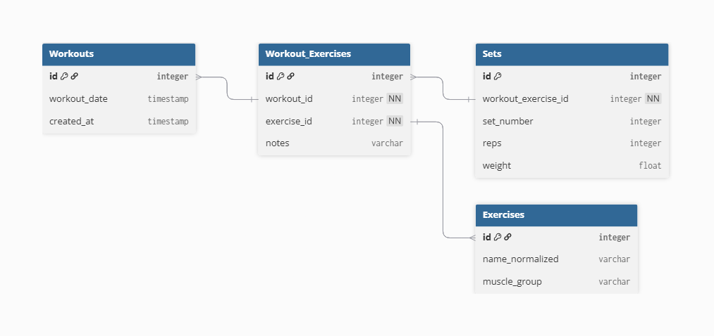

# ML Gym Tracker

End-to-end data pipeline for strength training analytics and machine learning.

This project transforms raw, unstructured workout notes into a normalized relational database, enabling performance analysis, visualization, and future LLM-based adaptive workout plan generation along with progressive overload forecasting using ML.

---

## Project Goals

- Parse raw workout notes (TXT format)
- Build a web interface to log new sessions and auto-add new exercises to the database.
- Normalize and store structured data in PostgreSQL
- Perform analytical queries (volume, progression, trends)
- Expose data via API (planned)
- Progressive Overload Forecasting using ML
- Integrate an LLM to generate adaptive workout plans based on historical performance.
- Containerize and deploy as a production-ready service.

---

## Architecture Overview

Raw text → Parser (ETL) → PostgreSQL → ORM → Analytics

The system follows a normalized relational design to ensure scalability and analytical flexibility.

---

## Database Schema



### Tables

#### `Workouts`

Stores individual training sessions.

| Column       | Type         |
| ------------ | ------------ |
| id           | integer (PK) |
| workout_date | timestamp    |
| created_at   | timestamp    |

---

#### `Exercises`

Dictionary of normalized exercise names.

| Column          | Type               |
| --------------- | ------------------ |
| id              | integer (PK)       |
| name_normalized | varchar (unique)   |
| muscle_group    | varchar (optional) |

---

#### `Workout_exercises`

Join table linking workouts and exercises.

| Column      | Type               |
| ----------- | ------------------ |
| id          | integer (PK)       |
| workout_id  | integer (FK)       |
| exercise_id | integer (FK)       |
| notes       | varchar (optional) |

---

#### `Sets`

Atomic training data (one row = one set).

| Column              | Type         |
| ------------------- | ------------ |
| id                  | integer (PK) |
| workout_exercise_id | integer (FK) |
| set_number          | integer      |
| reps                | integer      |
| weight              | float        |

---

## Why This Design?

- Fully normalized (3NF)
- Atomic training data (1 set = 1 row)
- Scalable to multiple users
- Ready for analytics and ML
- Backend/API friendly

---

## Example Analytics

### Total Volume per Exercise

```sql
SELECT e.name_normalized,
       SUM(s.reps * s.weight) AS total_volume
FROM sets s
JOIN workout_exercises we ON s.workout_exercise_id = we.id
JOIN exercises e ON we.exercise_id = e.id
GROUP BY e.name_normalized;
```
